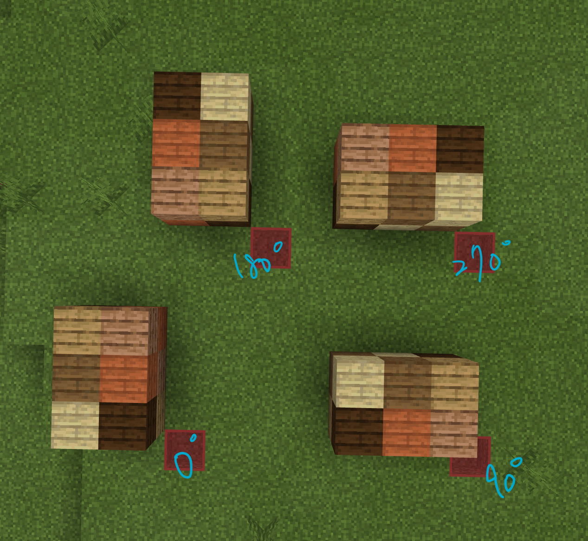

## Remote Control for Minecraft Education Edition
This web app is for the purpose to remote control the code bot in Minecraft Education Edition, such as moving bot or execute the command as player who host the game. To achieve this objective, you need to install both [Minecraft Education](https://education.minecraft.net/) and [Code Connection for Minecraft](https://www.microsoft.com/zh-tw/p/code-connection-for-minecraft/9ppfpg2fg2qb?SilentAuth=1&activetab=pivot:overviewtab) on your computer.

### Usage
1. Clone this project.
2. Run `npm install`.
3. Run `npm start`.
4. If dashboard does not show automatically, it can be opened at [localhost:3000](http://localhost:3000)

### Feature

#### Inspect block
Inspect the block at the [direction] of the bot in game, return the `block name`.

#### Inspect Data
Inspect the block data at the [direction] of the bot in game, return the `int` `block data`.

#### Scan Structure in Game
Scan the structure from front left of player position to the specific size `[sizeX] * [sizeY] * [sizeZ]`.
Note that player should stand at the position with smallest x and z in-game coordinate value.
Once the scan process is done, a link to download the stringify array in `json` format will show.

The performance is about 1 sec/block and a little bit quickly if the block above is `air`. Depending on your network speed.

#### Build Scanned Structure
Load the `json` file of the scanned structure, and choose the [rotate] value. Then the structure will be reconstruct in the game. Just like scanning function, it will reconstruct the structure from the front left of player position. Note that even the structure is rotated, the point with minimum (x, z) value will always at the front left of player, as shown in below. 

  
